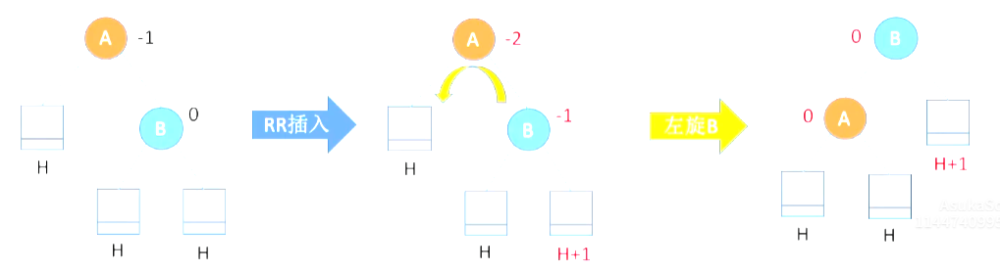

# Data Structure

# 逻辑结构和存储结构

### 逻辑结构
* 抽象的
* 描述数据元素之间的逻辑关系
* 对人类阅读更友好
* 分为：集合结构（无关系）， 线性结构（一对一）， 树形结构（一对多）， 图形结构（多对多）

### 存储结构
* 具体的
* 指的是数据结构在计算机中的具体表示
* 对机器更友好
* 分为：顺序存储， 链式存储， 索引存储， 散列存储

##### 顺序存储
* 能够随机存储（指的是能任意定位到随机的某个元素）
* 每个元素占用最少空间
* 必须使用整块的内存， 会产生较多内存碎片

##### 链式存储
* 只能顺序存储
* 每个元素需要额外空间存储下一节点指针
* 充分利用内存空间， 不会产生碎片

# 算法

### 概念
* 程序 = 数据结构 + 算法
* 是对特定问题求解步骤的一种描述
* 特性：
    1. 有穷性（有限的步骤， 不能无限循环）
    2. 确定性（每一步不能有歧义）
    3. 可行性（可以使用已有的基本操作来实现）
    4. 输入（0或多个输入）
    5. 输出（1或多个输出）

### 时间复杂度
* 事前预估算法的时间开销 `T（n）` 和问题规模 `n` 的关系， 或者说 `T（n）` 和 `O（f（n））` 的关系
* 只考虑n的高阶部分， 并且可以省略常数项系数， 使用 `O（n）` 来表示时间复杂度
* 只需要关注循环操作， 并且只需要关注最深层循环的次数
* `T（n）` 的加法， 只保留最高阶项， 乘法则都要保留
* $O（1） < O（log_2n） < O（n） < O（nlog_2n） < O（n^2）$
* 常对幂指阶记忆法
* 最坏时间复杂度， 平均时间复杂度（指所有示例出现概率相等情况下）， 最好时间复杂度

### 空间复杂度
* 内存开销S（n）和问题规模n的关系
* 考虑数组的占用， 递归调用栈空间的占用

# 线性表
* n个相同类型元素组成的有序的集合
* 元素个数有限， 元素数据类型相同， 逻辑上有顺序性
* 是逻辑结构中的线性结构

### 顺序表
* 是线性表的存储结构的实现方式1
* 可以随机存取， 每个节点只存储数据
* 插入删除操作效率低， 需要整段连续内存存储（底层数组实现）

### 单链表
* 是线性表的存储结构的实现方式2
* 插入删除只需要修改指针指向，所以速度快
* 无需连续存储空间
* 无法随机读取，查找需要从头开始
* 存储指针存在空间的浪费

##### 结构体数据占用空间问题
* 结构体指针本身占用空间4或者8，取决于32位或者64位系统
* 结构体内各个元素相加后凑整，8，16等

# 数组&矩阵

### 一维数组
* 地址，索引默认从0开始
$$ a[i] = 起始地址 + i * sizeof（ElemType） $$

### 二维数组
* 地址
* 行优先
  * $a[i][j] = 起始地址 + （i * N + j） * sizeof（ElemType）$   
* 列优先
  * $a[i][j] = 起始地址 + （j * M + i） * sizeof（ElemType）$

### 对称矩阵
* `n` 行 `n` 列，`a（i， j） = a（j， i）`
* 可以进行压缩存储，例如只存储主对角线数据以及下三角区数据
* 数组大小
  * $size = \frac{（1 + n） \times n}{2}$
* 由于从`0`开始，所以最后元素的索引为 $\frac{（1 + n） \times n}{2} - 1$
* 矩阵的元素下标 `a（i， j）` 对应到数组的索引下标，公式为：（以存储主对角线数据以及下三角区数据为例）
* 行优先
  * $a（i，j） = \frac{（1 + i - 1） \times （ i - 1 ）}{2} + j - 1 = \frac{i \times （ i - 1 ）}{2} + j - 1$
  * 解析：`i` 代表前面有 `i-1` 行，那么 `i-1` 行的元素个数即为$\frac{（1 + i - 1） \times （ i - 1 ）}{2}$，`j` 代表当前这一行是第 `j` 个元素，由于数组索引从 `0` 开始，所以对应的索引需要再减去 `1` （注意矩阵的 `i`，`j` 一般从 `1` 开始，而数组索引从 `0` 开始）
* 列优先 
  * $a（i，j） = \frac{（n + （n - （ j - 1 ） + 1）） \times （ j - 1 ）}{2} + （ i - j + 1 ） - 1$ 
  * 解析：`j` 代表前面有 `j-1` 列，每一列的个数从 `n` 开始递减，第 `j-1` 列的元素个数是 `n-(j-1)+1`，`(i-j+1)` 代表是当前列的第几个元素

### 三角矩阵
* 下三角矩阵 指的是上三角区所有元素都相同
* 数组大小 
  * $size = \frac{（1 + n） \times n}{2} + 1$ 
  * 多一个位置来存储上三角区相同元素

### 三对角矩阵
* 指的是 `|i-j|>1` 时，`a（i，j）= 0` 这样的矩阵，也就是除了主对角线元素以及和主对角线相差一个单位元素之外，剩余位置元素都是0
* 数组大小
  * $size = （ 3 \times n - 2 ）$
  * 解析：除了第一行和最后一行只有两个元素，其余行都是三个元素
* 索引（行优先） 
  * $a（i，j） = （ 3 \times （ i - 1 ） - 1 ） + （ j - i + 2 ） - 1 \\ = 2i+j-3$
  * 解析：前面一共有 `i-1` 行，第一行少一个元素，当前行使用 `j-i+2` 求出第几个元素位置，最后索引从 `0` 开始所以再减一
* 根据索引 `k` 反求 `i`，`j`
  * 解析：索引 `k`，代表是第 `k+1` 元素，根据不等式：前 `i-1` 行元素 < 第 `k+1` 元素 <= 前 `i` 行元素，假设一行 `3` 个元素，则有 $3（i-1）- 1 < k + 1 <= 3i - 1$，得 $i >= \frac{（k + 2）}{3}$，向上取整，再根据 $k = 2i + j - 3$，求出 `j`

### 稀疏矩阵
* 指的是非 `0` 元素个数远远少于 `0` 元素个数的矩阵
* 缺点：失去随机存取特性
* 使用一些技巧进行压缩存储，例如
  * 顺序存储三元组 （行号， 列号， 非 `0` 值） 行列号码从 `1` 开始
  * 链式存储十字链表法 

# 树&二叉树

### 树

##### 概念
* 度数：指的是结点有几个孩子
* 度为 `m` 的树：指的是这棵树至少有一个结点的度为 `m`，一定是非空树，至少有 `m+1` 结点
* m叉树：指的是允许所有结点的度小于 `m` ，可以是空树

##### 性质
1. 结点数量 = 总分支数(总度数) + 1 
2. 总分支数(总度数) = $1n_1 + 2n_2 + 3n_3 + ... + mn_m$
3. 结点数量 = $n_0 + n_1 + n_2 + n_3 + ... + n_m$
4. `n` 个结点的树有 `n-1` 条边
5. 度为 `m` 的树，第 `i` 层，至多有 $m^i - 1$ 个结点
6. 高度 `h` 度为 `m` 的树，至少有 $h + m - 1$ 个结点
7. `m` 叉树，第 `i` 层，至多有 $m^i - 1$ 个结点
8. 高度 `h` 的 `m` 叉树，至多有 $（m^0 + m^1 + m^2 + ... + m^h - 1）\\ = \frac{（1 - m^h）}{1 - m}$ 个结点
9. 高度 `h` 的 `m` 叉树，至少有 `h` 个结点
10. `n` 个结点的 `m` 叉树，最小高度是 $log_m （n（m - 1） + 1）$ 向上取整

### 二叉树

##### 满二叉树 
* 高度 `h` ，有 $2^h - 1$ 个结点 
* 性质
  * 只有最后一层才会出现叶子结点 
  * 不存在度为 `1` 的结点 
  * 从上到下从左到右编号，从 `1` 开始 结点 `i` 的左孩子是 `2i` ，右孩子是 `2i+1` ，父结点是 $\frac{i}{2}$ 向下取整
  * 高度h的满二叉树,对应的森林所含有的树的个数也是h

##### 完全二叉树
* 就是最后一层不满的满二叉树
* 完全二叉树不一定是满二叉树，而满二叉树一定是完全二叉树
* 直观理解就是连续的去除掉最后一层中编号较大的叶子结点
* 性质
  * 只有最后一层以及倒数第二层会出现叶子结点
  * 最多只有一个度为 `1` 的结点
  * 从上到下从左到右编号，从 `1` 开始 结点 `i` 的左孩子是 `2i` ，右孩子是 `2i+1` ，父结点是 $\frac{i}{2}$ 向下取整
  * `n` 个结点的完全二叉树，$i <= \frac{n}{2}$ 取整时代表 `i` 是分支结点，$i > \frac{n}{2}$ 取整时代表 `i` 是叶子结点

##### 二叉排序树
* 左子树所有结点的关键字（即数值）都小于根结点的关键字
* 右子树所有结点的关键字都大于根结点的关键字

##### 平衡二叉树
* 任意结点的左子树和右子树的高度（深度）之差小于等于 `1`

### 常见考点
1. 非空二叉树，度为 `0` ，`1` ，`2` 的结点个数为 $n_0$，$n_1$，$n_2$，则有 $n_0 = n_2 + 1$，而 $n_1$ 只可能取值 `0` 或者 `1`
2. 二叉树，第 `i` 层的结点数量，最多是 $2^i - 1$
3. 高度 `h` ，二叉树，最多有 $2^h - 1$ 结点（即满二叉树）
4. 完全二叉树，n个结点，高度为 $h = log_2(n + 1)$ 向上取整
5. n个结点的二叉链表有n+1个空链域,可以构建线索二叉树
6. m叉树,结点i,双亲编号$\frac{(i-2)}{m}向下取整+1$,而第一个子女编号为$(i-1) \times m + 2$,第k个子女编号为$(i-1) \times m + k + 1$

### 二叉树的存储结构

##### 顺序存储
* i结点的左孩子,右孩子,父结点
* 适合存储完全二叉树,存储普通二叉树时可能会浪费很多内存空间

##### 链式存储
* n个结点的二叉链表有n+1个空指针域,可以构建线索二叉树

### 二叉树的遍历

##### 根据序列构建二叉树
* 仅仅凭借前序序列或者中序序列或者后序序列或者层序序列,是无法构建唯一二叉树的
* 前序+中序：前序序列的首元素就是根节点,但是要结合中序序列
* 后序+中序：后序序列的最后元素就是根节点,但是要结合中序序列
* 层序+中序：层序遍历的首元素就是根节点,第二个元素就是左子树根节点,第三个元素就是右子树的根节点,但是要结合中序序列
* 必须结合中序序列才能确定唯一二叉树

### 线索二叉树
* 使用空的链表域记录前驱,后继结点,目的是为了方便的找到结点前驱和后继
* 额外增加ltag和rtag来区分孩子结点还是线索结点
* 中序序列,前序序列,后序序列都可以更改后变成线索二叉树

# 树&二叉树

### 树的存储结构

##### 树的逻辑结构
* 分支结点可以有多个子树

##### 双亲表示法
* 使用数组存储结点,类似于静态链表
* 结点=数据值+父结点地址
* 可以存储树,森林
* 找父结点容易,但是找子结点困难,需要完整遍历数组,适用于并查集的场景

##### 孩子表示法
* 顺序存储+链式存储实现
* 结点=数据值+孩子结点地址,多个孩子结点使用链表
* 可以存储树,森林
* 找子结点容易,但是找父结点困难,适用于服务流程树的场景(如客服电话)

##### 孩子兄弟表示法
* 类似二叉树,使用二叉链表实现
* 可以存储树,森林

### 树&森林&二叉树的相互转换

##### 树转换成二叉树
* 使用孩子兄弟表示法,就可以把树转换成二叉树
* 具体流程
  * 根节点,并且右孩子一定是null
  * 按照层序遍历进行结点的处理
  * 如果结点有孩子结点,则使用右指针串起来,并且指向结点的左指针

##### 森林转换成二叉树
* 同上面树转换成二叉树
* 区别是处理根节点时,需要把所有根节点使用右指针串起来

##### 二叉树转换成树
* 具体流程
  * 根节点
  * 按照层序遍历顺序处理其他结点
  * 如果结点有左孩子,将左孩子以及一串右指针拆下来,按照从左到右的顺序作为结点的子结点
  * 如果没有左孩子,就不处理

##### 二叉树转换成森林
* 根节点的处理不同,其余和上面二叉树转换成树的流程一样
* 根节点的处理需要把右指针串作为森林的跟

### 树

##### 先根遍历
* 类似于二叉树的前序遍历
* 同样可以使用手动划线的方法确定顺序
* 使用孩子兄弟法转换成二叉树后可以发现 二叉树的前序遍历和树的先根遍历一样
* 称之为深度优先遍历

##### 后根遍历
* 类似于二叉树的中序遍历
* 由于不知道有几个子结点,所以没办法使用手动划线的方法确定顺序,只能使用常规方法确定
* 使用孩子兄弟法转换成二叉树后可以发现 二叉树的中序遍历和树的后根遍历一样
* 称之为深度优先遍历

##### 层序遍历
* 类似于二叉树的层序遍历
* 称之为广度优先遍历

### 森林遍历

##### 先序遍历
* 方式1:针对每一颗树进行先序遍历
* 方式2:转换成二叉树后,进行前序遍历

##### 中序遍历(后根)
* 方式1:针对每一颗树进行后序遍历
* 方式2:转换成二叉树后,进行中序遍历

### 考点
* 如果森林中非叶子结点数量为n,则对应二叉树中右指针为空数量为n+1,因为每一个非叶子节点代表其孩子中最后那个的右指针肯定为空,同时根节点最右兄弟的右指针也为空,所以是n+1
* 如果树的对应二叉树左指针域为空的数量是n,代表该结点没有子结点,是叶结点,即叶结点数量也是n

### 树&二叉树的应用

##### 哈夫曼树&哈夫曼编码

概念
* 结点的权: 类似权重
* 结点的权路径长度: 根到该结点的路径长度乘以该结点权
* 树的权路径长度(WPL): 所有叶结点的权路径长度之和
* 哈夫曼树: WPL最小的二叉树,也叫做最优二叉树
* 哈夫曼编码: 用构建哈夫曼树的方式去构建的字符集编码,字符集的每个字符作为叶子结点,字符的出现频率作为权重,
二叉树的左路径和右路径分别代表0/1(或者1/0)
* 可变长度编码: 不同的字符使用不同长度的二进制数表示
* 前缀编码: 没有编码是其他编码的前缀,即能够区分开不同编码

构建哈夫曼树
* 给定n个结点来构建一颗哈夫曼树
* n个结点作为n棵树所形成的的森林
* 选择权重最小的两个结点,构建一颗新的树,其权重是两个子结点权重之和
* 新树加入森林,并且删除掉刚刚构建使用的两个子结点
* 重复上面两个步骤,一直到森林中只剩下一棵树

考点
* n个叶结点构建的哈夫曼树,其总结点数量为2n-1
* 哈夫曼树没有度为1的结点,因为都是两两组合重复构建出来的
* n个叶结点构建的哈夫曼树,并不是唯一结构的,但是WPL都是最优的
* 哈夫曼树的权路径长度计算方法
  * 所有叶结点的权路径长度之和
  * 所有分支结点的权之和
* 度为m的哈夫曼树,只会包含度为0和度为m的结点,则结点总数N为
  * $N=n_0+n_m$
  * $N=mn_m+1$
* 度为m的哈夫曼树,只会包含度为0和度为m的结点,叶结点个数为n,则非叶结点个数为 $\frac{n-1}{m-1}$,特别的,当m=2时,退化成n-1
* 定长编码集:在定长编码集中,所有字符都处于相同一层,而且都是叶结点
* 哈夫曼编码的加权平均长度算法:$\frac{WPL}{叶结点权值之和}$

##### 并查集

概念
* 集合这种逻辑结构可以使用树(森林)进行表示
* 树的双亲表示法的应用场景
* 查询操作: 向上查找根节点,最坏时间复杂度 $O(n)$
* 合并操作: 向上查找到根节点,然后合并两棵树,时间复杂度 $O(1)$
* n个独立结点多次union合并为一棵树(集合),最坏时间复杂度 $O(n^2)$

优化合并操作
* 根节点的parent不再单纯存储-1,而是存储-n,n代表这棵树的结点总数
* 两棵树合并时,让小树合并到大树
* 构建的树的高度不超过 $log_2 n (向下取整) + 1$
* 优化后查询的最坏时间复杂度 $O(log_2 n)$
* n个独立结点多次union合并为一棵树(集合),最坏时间复杂度 $O(nlog_2 n)$

优化查询操作
* 压缩路径
* 第一次循环,找到根结点
* 第二次循环,也是向上寻找根节点,但是在寻找的过程中,把经历过的结点,都直接挂载到根节点下
* 新构建的树高度不超过 $O(α(n))$,常见的n值的α(n)的值小于等于4,能大幅度优化查询和合并操作,查询的最坏时间复杂度即 $O(α(n))$
* n个独立结点多次union合并为一棵树(集合),最坏时间复杂度 $O(nα(n))$

# 图

### 概念

##### 基本概念
* 图由顶点集和边集组成
* 图不能为空,即图的顶点集不能为空,但是边集可以为空
* 集合本质上就是一种图(边集为空,但是顶点集不空)

##### 无向图&有向图概念
* 无向图:即边没有方向的概念,(使用圆括号表示一条边)
* 有向图:边是有方向的,(使用尖括号表示一条边)

##### 度&出度&入度概念

无向图
* 顶点的度:指的是对应到边的条数

有向图
* 顶点的入度:以顶点为终点的边条数
* 顶点的出度:以顶点为起点的边条数

##### 点到点关系概念

路径&回路&简单路径&简单回路
* 路径:一个顶点到另一个顶点之间经过的顶点的序列
* 回路:第一个顶点和最后一个顶点相同的路径
* 简单路径:顶点不重复的路径
* 简单回路:顶点不重复(除了第一个顶点和最后一个顶点外)的回路

路径长度
* 路径上的边的总数量

点到点的距离
* 指的是两个顶点之间最短路径,若不存在路径,则记作无穷 $\infty$

连通性&连通图
* 指的是无向图
* 连通性:无向图中,顶点到顶点有路径存在,则为连通
* 连通图:无向图中,任意两个顶点都是连通的

强连通性&强连通图
* 指的是有向图
* 强连通性:有向图中,顶点到顶点既有正向路径也有逆向路径,则为强连通
* 强连通图:有向图中,任意两个顶点都是强连通的

##### 边的权&带权图/网概念
* 网:指的是图的每条边都有权重值,也叫做带权图

##### 图的局部概念
* 极大连通子图:指的是子图是连通的,并且包含尽可能多的顶点和边
* 极大强连通子图:指的是子图是强连通的,并且包含尽可能多的顶点和边
* 连通分量:指的是无向图的极大连通子图,称之为连通分量,(注意需要极大)
* 强连通分量:指的是有向图的极大强连通子图,称之为强连通分量,(注意需要极大) 
* 极小连通子图:指的是边要尽可能的少,即n个顶点最少n-1条边
* 连通无向图的生成树:指的是连通无向图中,包含全部顶点的极小连通子图,可能有多种形态
* 非连通无向图的生成森林:指的是非连通无向图中,先找出所有的连通分量,再把所有连通分量改造为对应的生成树,这些生成树整体就构建了生成森林

### 特殊的图
* 无向完全图:指的是任意两个顶点之间都有边
* 有向完全图:指的是任意两个顶点之间都有相反两条边
* 稀疏图,一般来说边界是 $|E| < |VlogV|$
* 稠密图
* 树:本质上就是一个不存在回路的,连通的,无向的图,n个顶点最少n-1条边
* 森林:本质上就是一个个的连通的,无向的,极小连通子图
* 有向树:指的是一个顶点的入度为0,其余顶点的入度为1,的有向图

### 常见考点

n个顶点的无向图
* 所有顶点度之和为 $2\times边条数$
* 如果是连通图,则最少有 $n-1$ 条边,(例如一个根结点剩下都是子结点的树)
* 逆推:如果最少边的情况下减去一条边,就由连通变成不连通了 
* 如果是连通图,若边长数量大于 $n-1$ ,则一定有回路
* 如果是非连通图,则最多有 $C_{n-1}^{2}$条边,(例如抛开一个顶点,让剩余n-1个顶点互相之间都连通,即是最大条数)
* 逆推:如果最多边的情况下加上一条边,就由不连通变成连通 
* 如果是无向完全图,边的数量是 $C_{n}^{2}$

n个顶点的有向图
* 所有顶点的出度之和=入度之和=边条数
* 所有顶点的度之和等于 $2\times边条数$
* 如果是强连通图,则最少n条边,(例如刚好形成一个回路)
* 如果是有向完全图,边的数量是 $2C_{n}^{2}$

### 图的存储结构

##### 邻接矩阵

有向图和无向图的邻接矩阵
* 1代表邻接,0代表不邻接
* 无向图指定节点的度:检查行或者列非0元素个数即可
  * 时间复杂度 $O(n)$
* 有向图指定节点的出度:查找行,检查非0元素个数即可
* 有向图指定节点的入度:查找列,检查非0元素个数即可
* 有向图指定节点的度:查找列,查找行,求和
  * 时间复杂度 $O(n)$
* 邻接矩阵的表示方式是唯一的,不同于邻接表
* 空间复杂度高,适用于存储稠密的图
* 删除边方便,删除顶点则需要移动大量数据

有向网和无向网的邻接矩阵
* int最大值,或者0表示不邻接,其他正常数值代表邻接和权值
* 空间复杂度 $O(|V|^2)$ 只和顶点的数量有关,和边数量无关

邻接矩阵的性质
* 邻接矩阵$A$,有$A^n$的元素$A^n[i][j]$,例如
$$ A^2[1][4]=a_{1,1}a_{1,4}+a_{1,2}a_{2,4}+a_{1,3}a_{3,4}+a_{1,4}a_{4,4} $$
* $A^n[i][j]$的值代表着顶点$i$到顶点$j$的长度为$n$的路径的数量
* 计算例如$A^3$,使用$A^2$的结果再和$A$进行矩阵运算
* 邻接矩阵对角线以下(以上)全为0,则图不存在环,即存在拓扑序列(有向无环图),但是不能说明拓扑序列唯一
* 无向图的邻接矩阵一定对称,而有向图的邻接矩阵也有可能是对称的,例如任意两个顶点都有边,且是两条方向相反的边


##### 邻接表
* 数组+链表存储
* 可以存储无向图,有向图
* 和孩子表示法本质上是一样的
* 无向图空间复杂度$O(|V|+2|E|)$
* 有向图空间复杂度$O(|V|+|E|)$

有向图和无向图
* 无向图指定节点的度:遍历数组中某个顶点存储的边链表里面包含了多少边结点
* 有向图指定节点的出度:和上面一样
* 有向图指定节点的入度:比上面麻烦,需要遍历所有顶点存储的边链表,判断哪些是要查找的入度
* 注意实际上邻接表的顶点存储的边链表是不唯一的,谁在前谁在后都可以,因为边链表里面的这些边结点没有先后顺序
* 比邻接矩阵更适合存储稀疏图
* 无向图中,删除边或者顶点都不方便

考点
* 无向图,n个顶点,e条边,建立邻接表的过程中,n+2e,时间复杂度是$O(n+e)$
* 有向图,n个顶点,e条边,某个顶点入度,时间复杂度是$O(n+e)$
* 有向图,n个顶点,e条边,删除和某个顶点相关边,时间复杂度是$O(n+e)$
* 顶点v在边表中出现的次数就是顶点v的入度

##### 十字链表
* 用于存储有向图
* 邻接矩阵空间复杂度高,邻接表查询入度麻烦,使用十字链表
* 空间复杂度$O(|V|+|E|)$
* 寻找入度很容易
* 删除边和顶点很方便

##### 邻接多重表
* 用于存储无向图
* 邻接矩阵空间复杂度高,邻接表存储边时存储两份,冗余,删除顶点,边时,时间复杂度高
* 空间复杂度$O(|V|+|E|)$
* 寻找相邻边很方便
* 删除边和顶点很方便


### 图的基本操作

##### 基本操作
详见代码

##### 广度优先遍历

BFS
* 类比树的层序遍历
* 思路1: 通过某个结点,找到相邻的其他结点,对于树来说,找孩子结点即可,由于不存在回路,所以不会重复
* 思路2: 如何避免重复,针对已经出现的结点进行标记
* 思路3: 仍然使用辅助队列进行入队和出队

考点
* 无向图,调用BFS的次数等于连通分量数量(极大连通子图数量)
* BFS,空间复杂度,来自于辅助队列,最坏$O(|V|)$
* BFS,时间复杂度,使用邻接矩阵存储,$O(|V|^2)$
* BFS,时间复杂度,使用邻接表存储,$O(|V|+|E|)$
* 广度优先适合求边权值相等的图的最短路径问题

广度优先生成树
* 根据BFS遍历的过程,记录下顶点和不重复的第一次经过的边,形成了一颗广度优先生成树
* 不同的邻接表的存储方式,对应不同的BFS遍历顺序,从而对应不同的广度优先生成树
* 深度优先生成树的高度总是大于等于广度优先生成树的高度

广度优先生成森林
* 类似广度优先生成树的形成过程

##### 深度优先遍历

DFS
* 类似树的先序遍历
  

考点
* 空间复杂度,最坏情况是递归深度$O(|V|)$,即每一个顶点都压栈一次
* 时间复杂度,使用邻接矩阵存储,$O(|V|^2)$
* 时间复杂度,使用邻接表存储,$O(|V|+|E|)$
* 深度优先算法或者拓扑排序算法可以判断有向图是否有环(回路)

深度优先生成树
* 类似于BFS生成树,也是按照遍历顺序生成
* 深度优先生成树的高度总是大于等于广度优先生成树的高度

深度优先生成森林
* 同样类似于BFS生成森林

##### 图的遍历和连通性质
* 无向图进行BFS或者DFS,调用BFS或者DFS次数等同于连通分量数量
* 那对于连通图,只需要调用一次
* 有向图进行BFS或者DFS,情况复杂,要根据具体问题进行分析
* 对于强连通图,只需要调用一次

### 图的应用

##### 最小生成树
* 之前的极小连通子图概念
* 边携带权值,且总体权值最小,则叫做最小生成树,最小生成树形态不唯一(当存在权值相同的边时),但是代价一定是唯一的
* 注意总体权值最小,而不是每条边都是权值小的边,有可能有的边的权值是大于未使用的边的权值的
* 当权值互不相同,则最小生成树是唯一的
* 顶点n边数n-1的无向连通图,本身既是一棵树又是一颗最小生成树
* 注意图必须是连通图,如果是非连通图,则只有生成森林的概念
* Prim算法和Kruskal算法,当最小生成树唯一的时候,这两个算法得到的最小生成树是相同的

Prim算法
* 任意顶点开始构建生成树,每次选择代价最小顶点一直到所有顶点结束
* 代价最小指的是:权值最小且不能顶点重复
* 选择顶点
* 时间复杂度:$O(|V|^2)$ ,适合边稠密图
* 代码实现思路:isJoin数组和lowCost数组,n个顶点需要n-1轮外层循环,每一轮循环需要处理:循环找到lowCost最低顶点加入树,以及再次循环更新顶点的lowCost值,即2n次循环,所以总体需要$O(|V|^2)$

Kruskal算法
* 每次选择权值最小的边,使之两头的结点连通,结点已经连通就不选择,一直到所有结点都连通
* 选择边
* 时间复杂度:$O(|E|log_2|E|)$ ,适合边稀疏图
* 代码实现思路:按照权值进行边的排序,检查每条边的顶点是否连通(并查集实现),e条边需要循环执行e轮,并查集判断需要$log_2e$,总计需要$O(|E|log_2|E|)$

##### 最短路径问题
* 两点之间的最短路径也包含了路径上其他顶点之间的最短路径
* 最短路径一定是简单路径(顶点不重复)

##### 最短路径问题之BFS算法
* 单源最短路径问题,无权图,使用这种算法
* BFS广度优先遍历
* 代码实现思路:修改BFS,增加d[i]数组,表示顶点u到顶点i的最短路径,以及path[i]数组,表示这个最短路径是从哪个顶点来的,在visit方法处,d[w]=d[u]+1,path[w]=u

##### 最短路径问题之Dijkstra算法
* 单源最短路径问题,无权图或带权图,使用这种算法
* 时间复杂度$O(|V|^2)$,如果求每对顶点间最短路径则需要调用该算法n次,时间复杂度$O(n^3)$
* 该算法不适用于带有负权值边的带权图


```c
// int最大值
#define MAX_INT 2147483647
// 伪代码
void Dijkstra()
{
  // 初始化
  bool final[5] = {true,false,false,false,false};
  int dist[5] = {0,10,MAX_INT,MAX_INT,5};
  int path[5] = {-1,0,-1,-1,0};
  // 循环,一直到final所有值都为true
  while(final[i] == false && dist[i] == min)
  {
    final[i] = true;
    // final = {true,false,false,false,true};
    // 更新i顶点的邻接顶点的对应的dist和path对应的值
    dist = {0,8,14,7,5}
    path = {-1,4,4,4,0}
  }
}
```

##### 最短路径问题之Floyd算法
* 各个顶点间最短路径问题,无权图或带权图,使用这种算法
* 动态规划思想:n个顶点,求vi到vj的最短路径,拆分为n个步骤:
  * 不允许其他顶点中转的最短路径
  * 允许v0中转的最短路径
  * 允许v0,v1顶点中转的最短路径
  * 等等
* 代码实现思路:A(i)矩阵,代表顶点间的最短路径长度,path(i)矩阵,代表中转顶点;一直增加中转节点个数更新A矩阵和path矩阵;更新判断的条件:若A[i][j]>A[i][k]+A[k][j]则path[i][j]=k,A[i][j]=A[i][k]+A[k][j]
* 最外层循环代表不断加入的中转顶点k,内层两层循环是针对矩阵进行的,体会每次都是基于上一步最优结果再进行更新的这种思想
* 时间复杂度:$O(|V|^3)$
* 空间复杂度:$O(|V|^2)$
* 不能解决带有负权回路的图的问题,但是能解决带有负权不带回路的图的问题

##### 有向无环图(DAG)
* 如何将表达式树转换成DAG,参考内容见3.3.2栈在表达式求值的应用
* 同样都能够表达一个表达式,但是有向无环图能够节约存储空间,因为能够对相同的节点进行共享,这点区别于二叉树
* 或者先转换成二叉树再进行合并,转换成二叉树的方法见前面章节
* 王道总结的转换方法,重点在于合并
  * 操作数不重复的摆成一排
  * 运算符标注生效顺序,不同顺序导致生成的树不唯一
  * 分层加入运算符
  * 从底层向上分层检查是否可以合并
* 有向图如果无法构成拓扑序列,则证明有环,即含有顶点大于1的强连通分量

##### 拓扑排序
* 一个DAG图,每个顶点只出现一次,顶点A在顶点B前面时,不存在B到A的路径;拓扑排序是对DAG顶点的一种排序
* 每个AOV网都有一个或者多个拓扑排序,这很正常 
* 代码实现思路:
  * AOV网找到入度为0的顶点并输出
  * 从AOV删除该顶点以及以他为起点的边
  * 重复上述步骤一直到AOV为空,或者不存在入度为0的顶点,能够判断是否有环
* 时间复杂度:$O(|V|+|E|)$ 邻接表,若使用邻接矩阵,则时间复杂度:$O(|V|^2)$
* 逆向拓扑排序,即拓扑排序逆转,如果是邻接表存储,则和边链表的顺序是有关的,代码演示
* 拓扑序列和逆向拓扑序列不唯一,唯一性的充分条件是每次输出顶点时检测入度为0的顶点是否唯一,每次都唯一则拓扑排序唯一,若拓扑序列唯一则入度0和出度0的顶点仅有一个
* 邻接矩阵是三角的,则存在拓扑排序序列,反之不成立,但是可能不唯一
* 若有向图存在拓扑排序,不一定是三角的邻接矩阵,但是拓扑排序序列有序,则邻接矩阵是三角的
* 能判断是否有环
* 有向图的拓扑有序序列唯一,容易联想到线性的有向图从而得出一个错误结论:顶点的入度和出度最多1,反例如下

* 上面的推论也说明:有向图的拓扑序列唯一并不能唯一确定一个图

##### 关键路径

AOE网
* AOE网,顶点表示事件(瞬间时刻),有向边表示活动,权值表示开销;也是一个DAG图
* 只有某个顶点的所有入边的活动都结束了,该顶点的事件才会发生;事件是可以并行进行的
* 只有在某个顶点事件开始后,从该顶点出发的边所代表的的活动才能进行
* AOE的边有权值,AOV的边没有权值
* 只有一个入度0的顶点,叫做开始顶点(源点);只有一个出度为0的顶点,叫做结束顶点(汇点)

关键路径&关键活动
* 从源点到汇点的所有路径中,最大路径长度叫做关键路径
* 关键路径代表了完成整体需要的最小开销时间,路径长度最长(权值)
* 事件的最迟发生时间,最早发生时间
* 活动的最迟开始时间,最早开始时间
* 活动的最早和最迟的差值就是时间余量
* 关键活动的时间余量为0
* 关键活动时间增加,则整体工期也增加
* 关键活动缩减到一定时,可能变成非关键活动
* 关键路径可能存在多条,只有减少所有关键路径上的关键活动,才能减少工期
* 关键路径中,任何的活动的时间的改变,都可能会导致到关键路径的改变,对于所有关键路径上的公共活动,延长不会导致改变,而缩短则可能会导致改变

求解关键路径
* AOE进行拓扑排序
* 求事件的最早发生时间,注意是max,加法
* AOE进行逆向拓扑排序
* 求事件的最迟发生时间,注意正向的最后节点就是逆向的最开始节点,而且时间是一样的
* 注意是min,减法
* 求活动的最早发生时间,即弧尾对应的事件的最早发生时间
* 求活动的最迟发生时间,即弧头对应的事件的最迟发生时间减去弧的权值
* 求时间余量,等于最晚减去最早,找到为0的活动(弧/边),就能找到关键路径
* 能判断是否有环(是因为拓扑排序)

### 知识点总结
* 判断有向图是否有环: 深度优先算法,拓扑排序算法,关键路径(是因为拓扑排序)
* 各种图算法的时间复杂度


# 查找

### 概念
* 静态查找表和动态查找表(除了查询操作外额外需要关注插入/删除)
* 查找长度: 需要对比关键字的次数称为查找长度
* ASL(平均查找长度): $ASL=\sum_{i=1}^{n} P_iC_i$
  * 其中,$P_i$是查找i元素概率,通常都是相等的;$C_i$是查找i的查找长度
* 通常考虑查找成功,查找失败的ASL

### 顺序查找
* 时间复杂度: $O(n)$
* 又称为线性查找,适用于顺序存储/链表存储,从头查询到尾/从尾查询到头
* 查找成功: $ASL=\frac{n+1}{2}$
* 查找失败: $ASL=n+1$ (有哨兵)

顺序查找优化(有序,使用查找判定树)
* 查找失败: $ASL=\frac{n}{2}+\frac{n}{n+1}$
* 查找成功: $ASL=\frac{n+1}{2}$
* 成功节点的查找长度为自身所在树的层数
* 失败节点的查找长度为父节点所在树的层数

顺序查找优化(被查找概率不等)
* 适用于查找成功场景,将被查找概率高的排在前面

### 折半查找
* 又称为二分查找,必须有序
* 基于顺序表,单链表不能使用
* 时间复杂度: $O(log_{2}n)$
* 查找成功: $ASL_{成功}=\frac{1\times1+2\times2+4\times3+4\times4}{1+2+4+4}$
* 查找失败: $ASL_{失败}=\frac{4\times3+8\times4}{4+8}$

* 由于n个结点的树有$n+1$个空链域,所以失败节点的数量也是$n+1$
  

查找判定树的构建
* 使用$mid=\frac{low+high}{2}$向下取整时,右子树节点减左子树节点等于0或1
* 该树一定是平衡二叉树
* n个结点的树的高度是$log_{2}(n+1)$,也是ASL的公式
* 该树也是二叉排序树,左子树关键字小于右子树

### 分块查找
* 又称为索引顺序查找
* 实现思路: 
  * 使用一个索引表来存储每个块,包含每个块的最大关键字,以及分块的索引范围
  * 查找的时候先查找索引表,定位范围
  * 再根据索引范围具体确定位置
* 针对索引表的查询,可以顺序查找也可以二分查找
  * 返回low对应的分块
* 针对块内查找只能顺序查找
* 特点
  * 块内无序,块间有序
* 针对ASL的分析,一般不会考察过于复杂的手算,但是如果分块内的元素个数都是相等的,且一共n个元素,索引表有b个元素,每个分块内都有s个元素,则有公式 
  * $ASL=\frac{b+1}{2}+\frac{s+1}{2}$且有$n=sb$
  * 当$s=\sqrt{n}$时,$ASL_{min}=\sqrt{n}+1$
* 若使用二分查找查询索引表,则公式为,不是很重要
  * $ASL=log_{2}(b+1)+\frac{s+1}{2}$

### 二叉排序树

##### 定义
* 二叉排序树(二叉查找树/BST)
* 左子树<根<右子树
* 中序遍历得到递增的序列

##### 查找效率分析
* ASL,详见二分查找的ASL计算
* 时间复杂度: 最好$O(log_{2}n)$,最坏$O(n)$

### 平衡二叉树

##### 定义
* 又称为AVL树,左子树右子树高度差不超过1

* 平衡因子: 左子树高度减去右子树高度,平衡二叉树只能是-1,0,1,注意叶子节点是0

* 意义在于:在构建一颗二叉排序树的过程中,如何保持平衡,成为平衡二叉树,需要关注的是最小不平衡子树

  最小不平衡子树就是刚刚出现绝对值大于1的平衡因子的节点所对应的那棵树,这个节点就是这个子树的根节点A,从根节点A开始来观察是属于下面四种情况的哪一种

* 最小不平衡子树: 每次调整的对象,调整的情况如下,注意下面四种情况都是说的插入新节点以后导致的而不是现有就是不平衡的;调整平衡的结果是恢复平衡并且保持二叉排序树
  * LL: 在A的左子树B的左子树中插入节点所导致的不平衡,称之为LL
  
    右旋B
  
  
  
  * RR: 在A的右子树B的右子树中插入节点所导致的不平衡,称之为RR
  
    左旋B
  
  
  
  * LR: 在A的左子树B的右子树中插入节点所导致的不平衡,称之为LR
  
    先左旋C再右旋C

    
  
  * RL: 在A的右子树B的左子树中插入节点所导致的不平衡,称之为RL
  
    先右旋C再左旋C
    
    
  
* 树高为$h$的平衡二叉树,含有的最少结点数量为$n_h$,有公式$n_h=n_{h-1}+n_{h-2}+1$,特别的,有$n_0=0$,$n_1=1$,$n_2=2$

* 根据节点求树的最大深度,也是使用上面递推公式

* 时间复杂度: $O(log_{2}n)$

* 根据节点数量求解二叉排序树的形态,卡特兰数$Catalan(n)=\frac{1}{n+1}C_{2n}^{n}$

* AVL树的定义,一般来说中序序列是升序的,但是如果中序序列是降序的,

##### 插入

* 保证二叉排序树,还要保证平衡(涉及到四种情况)

##### 删除

* 保证二叉排序树,还要保证平衡(同样有四种情况)

* 方法:

  * 按照二叉排序树的方法删除节点

  * 调整平衡:从删除节点开始一路向上寻找最小不平衡子树

  * 寻找该最小不平衡子树下面的个头最高的儿子孙子

  * 根据孙子的位置判断是四种情况的哪一种,然后调整平衡

    孙子节点是C,儿子节点是B,这样就可以理解了

    孙子节点位置是LL,则儿子节点右旋

    孙子节点位置是RR,则儿子节点左旋

    孙子节点位置是LR,则孙子节点先左旋再右旋

    孙子节点位置是RL,则孙子节点先右旋再左旋

  * 如果还不平衡,继续向上,重复第二步

* 性质:

  * 对于一颗AVL树,如果删除节点是叶子结点,那么先删除再插入得到的AVL树,是可能和原有AVL树保持不变的,当然也是可能改变了的

    如果删除的是非叶子结点,那么先删除再插入得到的AVL树,也是可能和原有AVL树保持不变,也可能发生改变的

    总之不管是删除叶子结点还是非叶子结点,先删除再插入得到的AVL树,是可能改变也可能不改变的

  * 但是如果不是AVL树,而只是一颗二叉排序树BST,那么当删除的节点是叶子结点,先删除再插入得到的BST和原有的BST是相同的

    如果删除的不是叶子结点,那么先删除再插入得到的BST和原有的BST是不同的


### 红黑树

##### 定义

* RBT,是一种二叉排序树的优化
* 查询,删除,插入时间复杂度都是$log_{2}n$,和平衡二叉树一样,那么红黑树的意义在于,不需要频繁调整平衡
* 所以平衡二叉树适合查询为主的场景,而红黑树更适合于频繁插入删除场景,在现在的工程场景中,基本上也不会用到平衡二叉树了,都是用的红黑树
* 黑高: 指的是某结点开始(不包含该结点)一直到叶结点,路径上黑色结点的总数量,(走任意一条路都是一样的)
* 红黑树需要满足下面的条件:
  * 根节点是黑色的
  * 叶子结点(指的是外部结点/NULL结点/失败结点)都是黑色的,这里的叶子结点不同于我们通常理解的叶子结点
  * 不存在两个相邻的红色结点,即红色结点的父结点和子结点必须是黑色的
  * 对于每一个结点来说,从该结点到任意一个叶子结点的简单路径上,所含有的黑色结点的数量是相同的
  * 左根右,根叶黑,不红红,黑路同

性质

* 二叉排序树的性质

* 根节点到达叶结点最长路径不大于最短路径的2倍

* 左右子树高度差,不会大于2倍

* $n$个内部节点的红黑树高度$h<=2log_{2}(n+1)$

* 根节点黑高如果是h,那么内部节点数量最少的情况是,全部都是黑色结点,满二叉树,最少有$2^h-1$

  若红黑树所有节点都是黑色节点,则一定是满二叉树

* 红色结点数量最多可以是黑色结点数量的2倍

* 红黑树由于存在红色结点,如果根结点是红色则这个子树就不是红黑树了,所以红黑树的子树不一定还是红黑树

* 

##### 查找

同平衡二叉树

##### 插入

类比平衡二叉树的插入操作,插入的时候最好把空的叶子结点也表示出来

* 先查找,确定要插入的位置

* 新节点是根,则黑色,否则红色(为了保证黑路同)

* 如果不满足红黑树定义(看是否违反不红红),则进行调整:看新节点的叔叔(指的是新节点的父结点的兄弟节点,有可能是空的叶子结点,这就是为啥要画出来空的叶子结点的原因)

  可以发现新插入节点如果破坏了红黑树,都是破坏了不红红这一条要求

  * 如果叔叔是黑色结点,则进行旋转加染色

    和平衡二叉树一样,是需要区分新节点位置然后区分四种情况的,多了一步染色操作

    注意染色的节点,指的是旋转了的节点进行染色

    染色指的是红色变黑色,黑色变红色

    LL/RR:由于旋转的节点是新插入节点的父节点,所以染色的自然是这个父节点以及原本的爷爷节点,即父换爷

    LR/RL:由于旋转的节点是新插入节点,所以染色的是新插入节点以及原本的爷爷节点,即儿换爷
  
  * 如果叔叔是红色结点,则进行染色加变新
  
    叔叔节点,父节点,爷爷节点都染色,爷爷节点看成是新插入的节点(再走一次新插入节点的判断逻辑,这里的判断主要是判断是否违反不红红,或者是否是根节点)
  
    染色指的是红色变黑色,黑色变红色

举例说明: 20,10,5,30,40,57,3,2,4,35,25,18,22,23,24,19,18


### B树

##### 概览

$m$叉查找树如何保证查找效率
* 除了根节点外(可以有但是不能保证有),其余任何节点保证至少有$\lceil\frac{m}{2}\rceil$个分叉,对应至少有$\lceil\frac{m}{2}\rceil-1$个关键字
* 任何一个节点的所有子树的高度要相等(不能有高度差)

B树
* 又称为多路平衡查找树
* m阶B树要么是空树,要么是$m$叉查找树
* 叶子节点指的是失败节点
* 而终端节点指的是我们通常理解上的叶子节点
* 非叶节点的数据都是保持有序的,能使用二分查找
* 支持随机查找,不支持顺序查找

B树性质
* 根节点的子树数量范围$[2, m]$,关键字数量范围$[1, m-1]$
* 其他节点的子树数量范围$[\lceil\frac{m}{2}\rceil, m]$,关键字数量范围$[\lceil\frac{m}{2}\rceil-1, m-1]$
* 任何一个节点的所有子树的高度要相等(不能有高度差)
* 关键字值的关系:$子树0<关键字1<子树1...$
* $log_m(n+1)<=h<=log_{\lceil\frac{m}{2}\rceil}(\frac{n+1}{2})+1$
* n个非叶子节点,m阶B树,关键字至少是$(n-1)*(\lceil\frac{m}{2}\rceil-1)+1$

$n$个关键字的$m$阶B树的高度
* 高度不包含叶子节点(失败节点)
* 最小高度:让节点尽可能满,$m$个分叉,$m-1$个关键字
  * $n<=((m-1)+m*(m-1)+m^2*(m-1)+...+m^{h-1}*(m-1))$
  * $((m-1)+m*(m-1)+m^2*(m-1)+...+m^{h-1}*(m-1))=m^h-1$
  * $h>=log_m(n+1)$
* 最大高度:让节点的分叉尽可能少,根节点最少2分叉,其他结点最少$\lceil\frac{m}{2}\rceil$分叉
  * 节点数量最少第一层1,第二层2,第三层$2*\lceil\frac{m}{2}\rceil$,第四层$2*\lceil\frac{m}{2}\rceil*\lceil\frac{m}{2}\rceil$,第n层$2*(\lceil\frac{m}{2}\rceil)^{h-2}$,叶子节点层$2*(\lceil\frac{m}{2}\rceil)^{h-1}$
  * $n$个关键字的B树,必有$n+1$个叶子结点
  * $n+1>=2*(\lceil\frac{m}{2}\rceil)^{h-1}$
  * $h<=log_{\lceil\frac{m}{2}\rceil}(\frac{n+1}{2})+1$
 
##### 插入操作

* 以5阶B树为例,省略失败节点,节点关键字数量范围[2, 4]
* 当一个节点插入满后,再插入会进行分裂,从$\lceil\frac{m}{2}\rceil$位置分裂为左子树,父,右子树三部分
* 父节点会向上插入到上一层的节点中,仍然是有序的
* 新元素的插入一定是插入到最底层的终端节点,用查找的算法来确定插入的位置
* 插入操作有可能影响树的高度

##### 删除操作

* 以5阶B树为例,省略失败节点,节点关键字数量范围[2, 4]
* 被删除关键字位于终端节点,直接删除,但是要保证删除后节点的关键字数量的范围[2, 4]
* 若节点数量不满足范围[2, 4],则细分为下列情况
  * 兄弟够借:从右兄弟或者左兄弟借节点,然后父子换位
  * 兄弟不够借:两兄弟以及这两兄弟的父节点进行合并,合并后可能仍然导致不满足范围,此时就需要继续调整
* 被删除节点位于非终端节点,使用直接前驱或者直接后继来代替被删除节点,然后删除掉直接前驱或者直接后继
* 删除操作一定会影响叶子节点的数量,因为关键字为n的叶子节点数量为n+1

### B+树

##### 概览

* 有点类似于分块查找
* 叶子节点指的不是失败节点,而是终端节点
* 根节点的关键字数量范围$[1, m]$
* 其他节点的关键字数量范围$[\lceil\frac{m}{2}\rceil, m]$
* 节点的子树的个数m等于关键字个数m,这是和B树的区别
* 叶子节点包含了全部的关键字以及对应的数据记录的指针,这是和B树的区别
* 叶子节点将关键字进行排序,这是和分块查找不同的(分块查找块内无序)
* 相邻的叶子节点用指针进行连接(链表)
* 分支结点包含了子节点中关键字的最大值以及指针,类似于分块查找,用于索引
* 支持随机查找和顺序查找
* 查找,插入,都是操作到了叶子节点

B+树的优势
* 非叶子节点不存储具体的记录,只保留关键字以及指针,这样一个磁盘块能包含更多的关键字信息,使得B+树的阶更大,树的高度更低,读取磁盘的次数更少,查找更快
* 更适合数据库索引和文件索引
* 支持顺序查找
